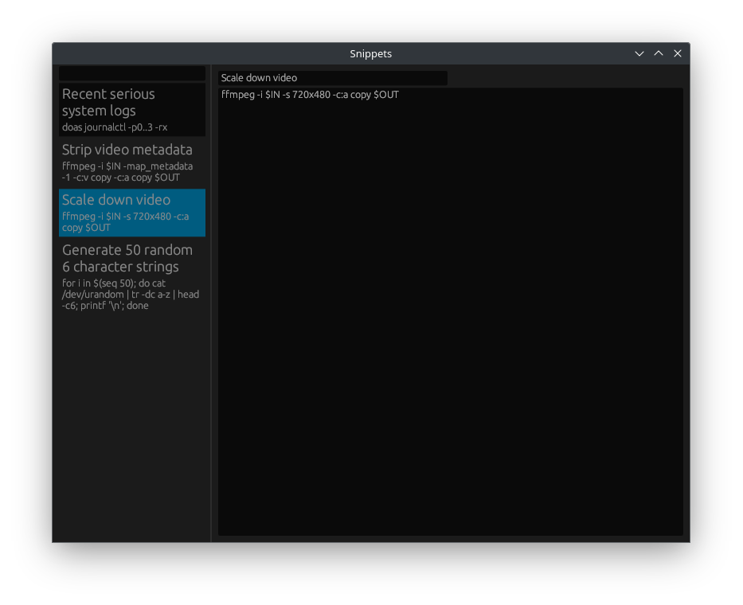

# Snippets

    

A code/note snippet manager.

## Features

- Fuzzy full-text search
- A single small, fast native binary

## TODO

- Syntax highlighting (tree-sitter?)
- Synonyms, so searching "cat" can return results containing "animal" and so on
- (Generally) make text bigger / make prettier
- Improve search accuracy