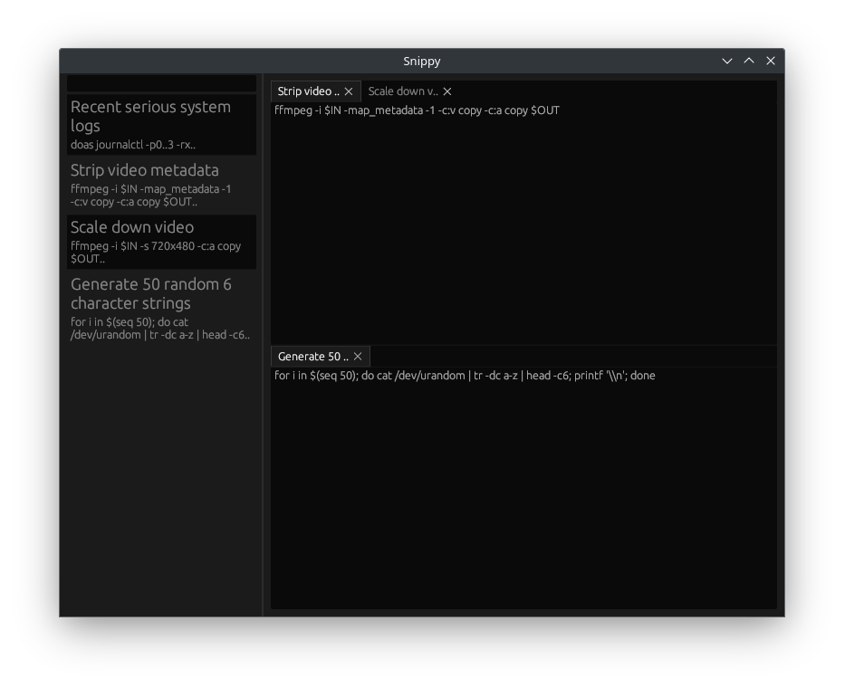

# Snippy

    

A code/note snippet manager.

## Features

- Fuzzy full-text search
- A single small, fast native binary
- Cross platform

## TODO

- Syntax highlighting (tree-sitter?)
- Synonyms, so searching "cat" can return results containing "animal" and so on
- (Generally) make text bigger / make prettier
- Persist open snippets
- SQLCipher support?
- Warn when closing dirty snippets
- Replace the current snippet with a newly opened one if it's never been modified, like VS Code
- Strip newlines from snippet hints
- Markup?
- Export to regular files
- `PRAGMA integrity_check` etc. on start
- Currently creating a grid (separating two tabs) makes the new root the grid instead of
    a tab tile, so newly opened notes are opened as a new grid tile. I'd rather they open
    in the leftmost tab tile.
- Maybe limit hints to one egui line